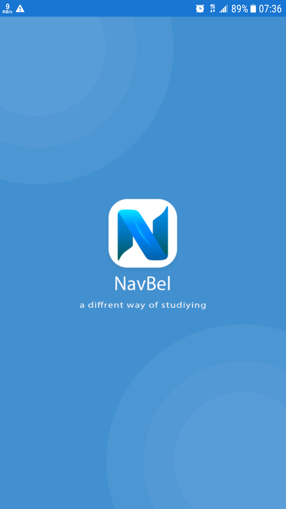
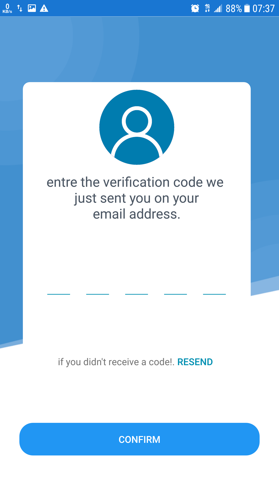
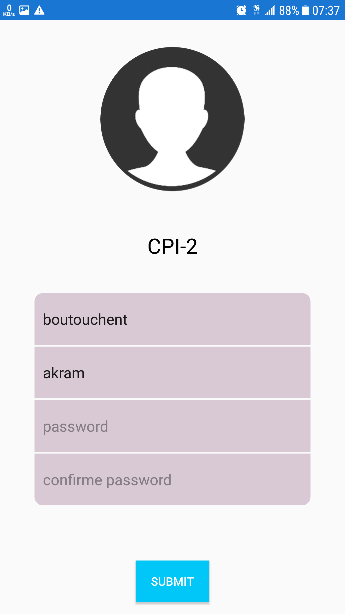
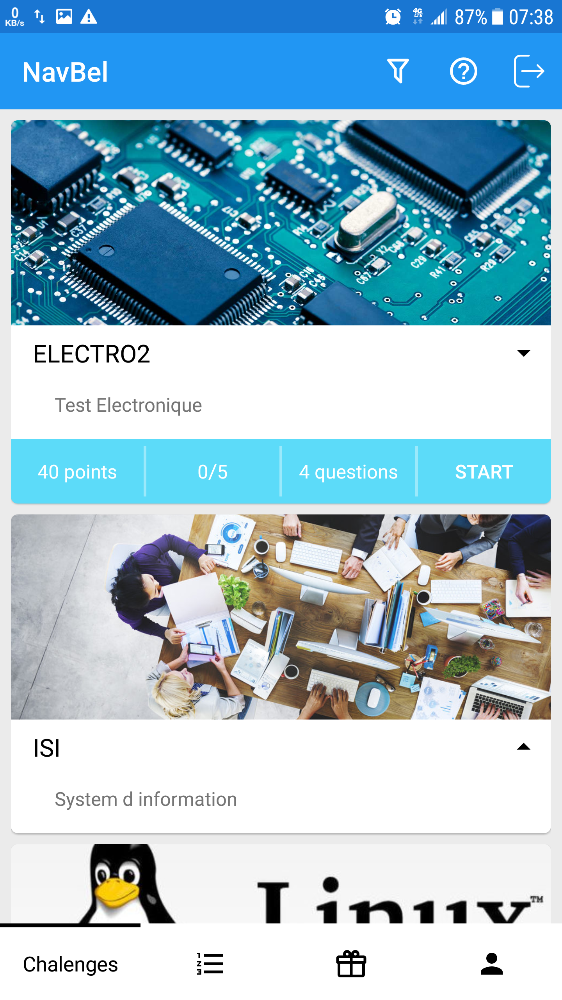

# Seconde Year Project Navbel (mobile application
Its an application that is created for student to provide another way of learning , the students will have some challenges in the main page and each challenge
has a number of question (QCM type) , after answering the challenge student will receive a number of points and can use them to 
obtain the recompense provided by the company 
this is the mobile application part of the project that containt a rest api , a dashboard website and a website this can be seen at 
[Mohamed Slamat](https://github.com/oxxy1337) 

## architecture used 
 * clean architecture 
 * Mvi architecture (modified version of Mvrx)
## Base libraries used
* RxAndroid
* Kotlin coroutines
* Androidx lifecycle (ViewModel , LiveData)
* Room (local database)
* Dagger (dependency injection)
*  Retrofit (Type-safe HTTP client)
## developed by
 - [Djawed Benahmed](https://github.com/roiacult)
 - [Boutouchent Akram](https://github.com/akram09)

